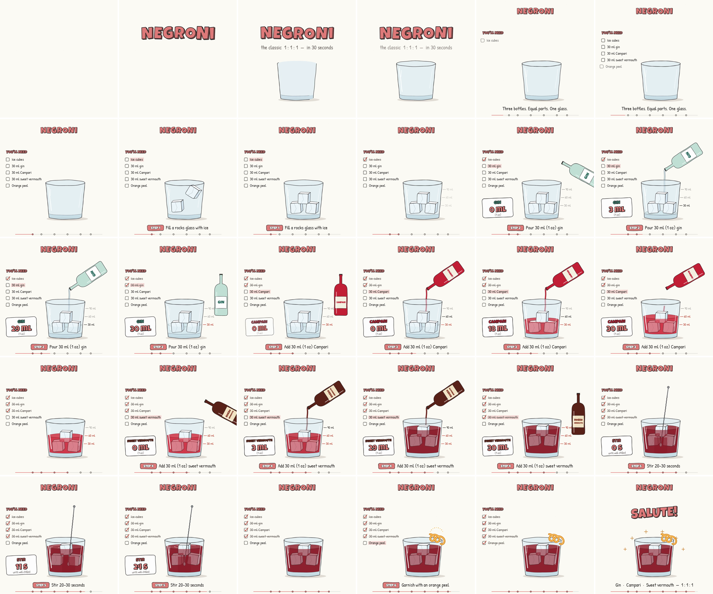

# Negroni — recipe motion graphic

A 30-second, 1080×1080 explainer animation that builds a Negroni from an empty glass to the finished cocktail. It shows every ingredient and its measurement as it goes into the glass.



**Output:** [`negroni.mp4`](negroni.mp4) (H.264, 30 fps, 900 frames)

## How it works

- `index.html` is one file with one pure `render(t)` function. Every frame depends only on time, so the same code gives a live, scrubbable preview (open the file in a browser) and a frame-exact export with no screen recording.
- Everything is drawn with HTML5 Canvas 2D: sketchy double-stroke lines with a slight "boil" at 8 fps, and the blocky 3D title style from the reference illustration.
- The fonts are Luckiest Guy and Patrick Hand (Google Fonts, OFL). They are vendored in `fonts/` so headless rendering works offline.
- `render.mjs` loads the page in headless Chromium through Playwright. It calls `render(t)` for all 900 frames and encodes them to MP4 with ffmpeg. It also writes a 6×5 contact sheet for visual QA.

## Storyboard

| Time | Beat |
|------|------|
| 0–3.5 s | Title pops in letter by letter, glass draws itself |
| 3.5–6 s | Ingredient checklist |
| 6–9 s | Step 1: three ice cubes drop in and bounce |
| 9–13.5 s | Step 2: 30 ml gin (bottle tilts, live ml counter, level marks) |
| 13.5–18 s | Step 3: 30 ml Campari (liquid turns red, the ice starts to float) |
| 18–22.5 s | Step 4: 30 ml sweet vermouth (deep Negroni red) |
| 22.5–26 s | Step 5: stir with a bar spoon |
| 26–28 s | Step 6: orange peel twist |
| 28–30 s | "Salute!" plus the 1 : 1 : 1 summary |

## Render

```bash
# needs Node + Playwright (Chromium) + an ffmpeg with libx264
node render.mjs            # -> negroni.mp4 + contact-sheet.png
node render.mjs --sheet    # -> contact sheet only (1 frame per second)
# optional: FFMPEG=/path/to/ffmpeg PLAYWRIGHT=/path/to/playwright FRAMES_DIR=/tmp/frames
```

To make another cocktail, change the `BOTTLES`, `LIST`, `CAPTIONS` and `LIQ` colours and the `T` timeline at the top of the script.
